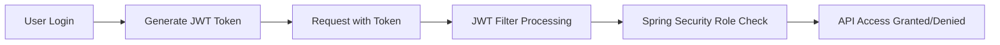

# 🛡️ Role-Based Authorization (RBAC) in Spring Boot + JWT

This guide outlines the implementation of **Role-Based Access Control (RBAC)** using Spring Boot Security and JSON Web Tokens (JWT).

---

## 📌 What is RBAC?

**Role-Based Authorization (RBAC)** is a security mechanism where access to system APIs is dynamically controlled based on assigned user roles.

* **ADMIN Role** \(\rightarrow\) Full system access (Read, Write, Update, Delete)
* **USER Role** \(\rightarrow\) Restrained system access (Read-only)



---

## 📁 Project Structure Changes

The following structure highlights the files updated during this implementation step:

```text
src/main/java/com/example/demo
├── 📂 model
│   └── 📄 User.java (updated)
├── 📂 dto
│   ├── 📄 UserRequestDTO.java (updated)
│   └── 📄 UserResponseDTO.java (updated)
├── 📂 service
│   └── 📄 UserService.java (updated)
├── 📂 security
│   └── 📄 CustomUserDetailsService.java (updated)
├── 📂 config
│   └── 📄 SecurityConfig.java (updated)
└── 📂 controller
    └── 📄 UserController.java (updated)
```

---

## 🛠️ Step-by-Step Implementation

### 1. Database Schema Update
Add the `role` column to your user persistence layer and seed initial permissions.

```sql
-- Add the role tracking column
ALTER TABLE user ADD COLUMN role VARCHAR(50);

-- Assign default roles for testing
UPDATE user SET role='ADMIN' WHERE id=1;
UPDATE user SET role='USER' WHERE id=2;
```

### 2. User Entity Update
Map the new database column to your core application entity.

```java
@Entity
@Table(name = "user")
public class User {
    // Existing fields...

    @Column(nullable = false, length = 50)
    private String role; 
}
```

### 3. Data Transfer Object (DTO) Changes
Expose the role tracking attribute through your data contracts.

#### 📄 `UserRequestDTO.java`
```java
public class UserRequestDTO {
    private String email;
    private String password;
    private String role; // Added for registration/updates
}
```

#### 📄 `UserResponseDTO.java`
```java
public class UserResponseDTO {
    private Long id;
    private String name;
    private String email;
    private String role; // Added to return role info
}
```

### 4. UserService Adjustment
Incorporate the role mapping logic inside your transactional domain layers.

```java
// Mapping Entity → DTO
return new UserResponseDTO(
        user.getId(),
        user.getName(),
        user.getEmail(),
        user.getRole()
);

// Mapping DTO → Entity (User Creation)
User user = new User();
user.setName(dto.getName());
user.setEmail(dto.getEmail());
user.setRole(dto.getRole()); // Set role mapping
```

### 5. CustomUserDetailsService Customization
Convert application roles into system-readable Spring Security standard Granted Authorities.

```java
@Override
public UserDetails loadUserByUsername(String email) throws UsernameNotFoundException {
    User user = userRepository.findByEmail(email)
            .orElseThrow(() -> new UsernameNotFoundException("User not found"));

    return org.springframework.security.core.userdetails.User
            .withUsername(user.getEmail())
            .password(user.getPassword())
            .authorities(user.getRole()) // Automatically maps role string as an authority
            .build();
}
```

### 6. Security Configuration Setup
Enable global method-level authorization checking inside the filter chain ecosystem.

```java
@Configuration
@EnableWebSecurity
@EnableMethodSecurity // Crucial anchor annotation for @PreAuthorize
public class SecurityConfig {
    // SecurityFilterChain config implementation...
}
```

### 7. Controller Endpoint Access Control
Enforce strict validation matching rules directly on routing handlers.

```java
@RestController
@RequestMapping("/api/users")
public class UserController {

    // Read Access: Accessible by both USER and ADMIN roles
    @PreAuthorize("hasAnyAuthority('USER','ADMIN')")
    @GetMapping
    public ResponseEntity<List<UserResponseDTO>> getAllUsers() {
        return ResponseEntity.ok(userService.findAll());
    }

    // Write Access: Exclusively isolated to ADMIN role
    @PreAuthorize("hasAuthority('ADMIN')")
    @DeleteMapping("/{id}")
    public ResponseEntity<Void> deleteUser(@PathVariable Long id) {
        userService.delete(id);
        return ResponseEntity.noContent().build();
    }
}
```

---

## 🧪 Testing and Verification Matrices

### Authenticating & Acquiring Context Token
Submit a `POST` request to your login route to get the security token.

* **Endpoint:** `POST /api/auth/login`
* **Payload:**
```json
{
  "email": "test@gmail.com",
  "password": "password123"
}
```

### Guarded Request Header Implementation
When invoking restricted system APIs, append the target authorization key:

```http
GET /api/users
Authorization: Bearer <YOUR_JWT_TOKEN_STRING>
```

### 📊 Expected RBAC Assertion Results

| Assigned User Role | Target API Endpoint | HTTP Method | Expected Result Status |
| :--- | :--- | :--- | :--- |
| `USER` | `/api/users` | `GET` | `200 OK` (✅ Access Allowed) |
| `USER` | `/api/users/1` | `DELETE` | `403 Forbidden` (❌ Access Denied) |
| `ADMIN` | `/api/users/1` | `DELETE` | `204 No Content` (✅ Access Allowed) |
